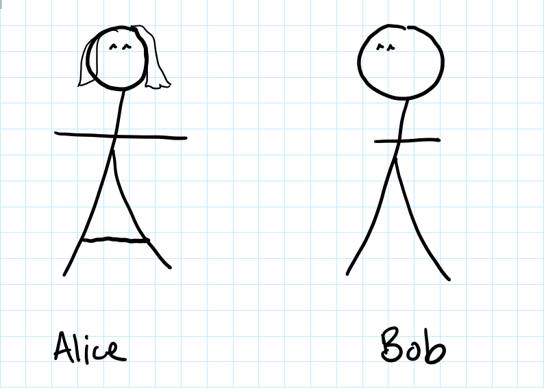
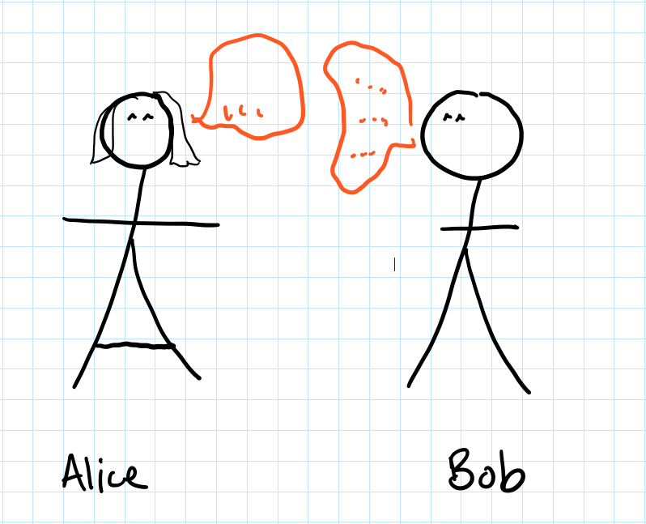
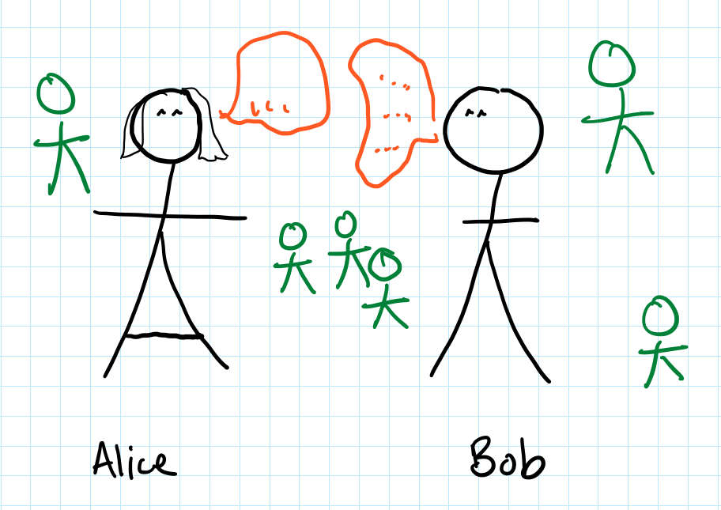
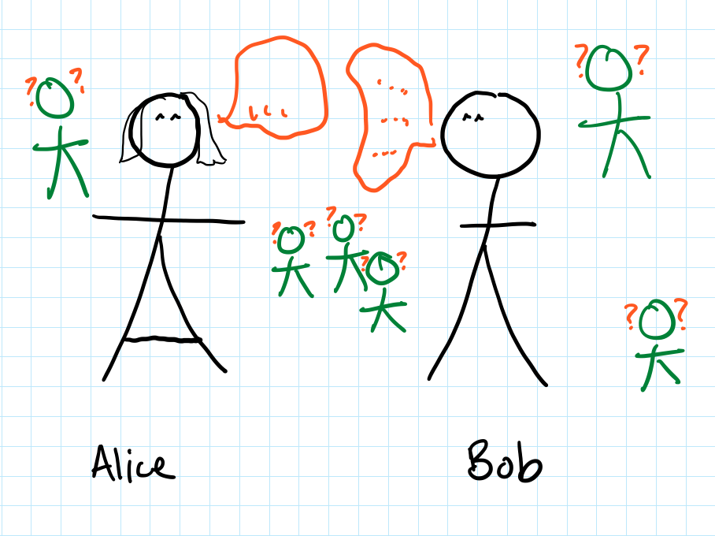
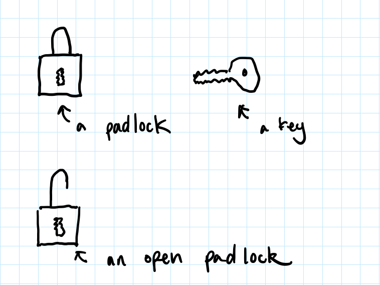
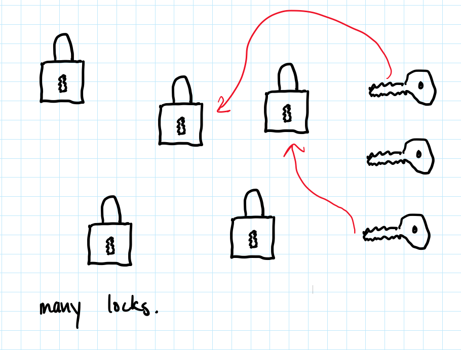
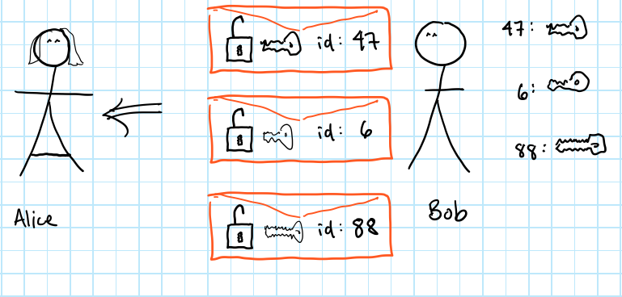
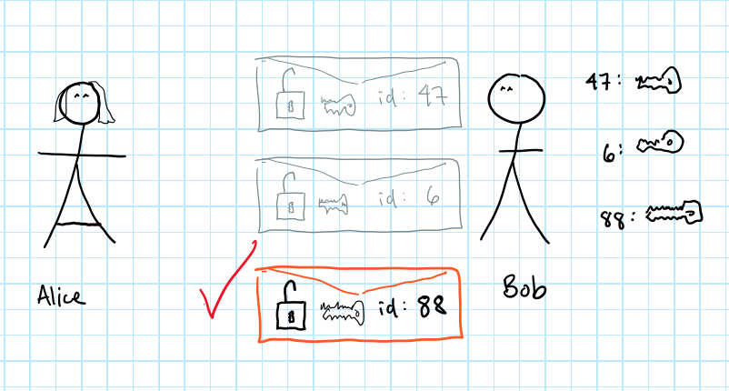
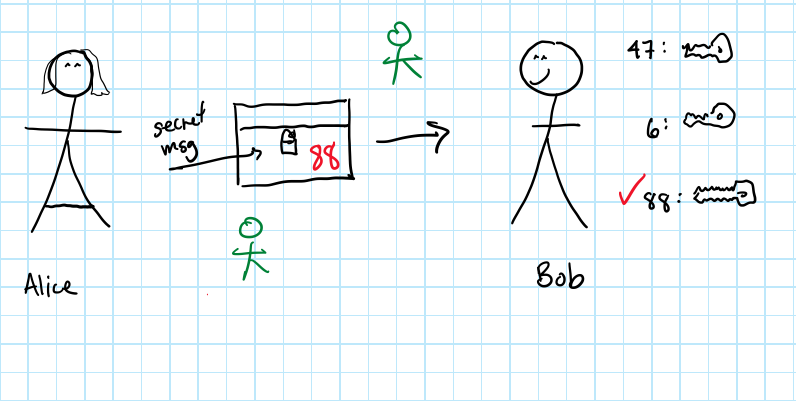

# Merkle's Problems

<!--Note: Thanks Jérérmie, Vanessa, Becky, Logan for organizing the student group.  Lanjun (Alex) Qi, Jintong Wu, David Binstock, Philipp Gaissert, and Dana Yang for organizing hackathon. the hackathoners -->

## What is the problem?
- Alice and Bob want to send messages.<!-- .element: class="fragment" -->
- Alice and Bob want to send messages in public.<!-- .element: class="fragment" -->
- Alice and Bob want to send messages in public but no one should understand their messages.<!-- .element: class="fragment" -->
  - People can eavesdrop but they shouldn't be able to understand the messages.<!-- .element: class="fragment" -->

<!--Note: this isn't from 551. it's of historical value and captures some of the ideas.  -->

<!-- .element: class="fragment" height="30%" -->  |  <!-- .element: class="fragment" height="30%"-->
:-------------------------:|:-------------------------:
<!-- .element: class="fragment" height="30%"-->  |  <!-- .element: class="fragment" height="30%" -->
<!--Note: The green people who are eavesdropping are called...Eve. So that's A, B conversation, you can...eve.  -->

## What's the key problem?

- How keys work is a whole todo, so let's imagine A and B use a padlock.<!-- .element: class="fragment" -->
- How do they exchange keys?<!-- .element: class="fragment" -->
  - Can Alice just send the key to Bob? (Why? Why not?)<!-- .element: class="fragment" -->
  - Can Alice just tell Bob the padlock ID? (Why? Why not?)<!-- .element: class="fragment" -->

## The fundamental problem is
  - How do two parties agree on a key when people can watch them talking about the key?<!-- .element: class="fragment" -->

## Use all the locks!

- Well, use a lot of them. Bob can send Alice say 3 envelopes of [padlock + key + random id].<!-- .element: class="fragment" -->
- Alice picks only one envelope, opens it and takes out the [padlock + key + random id].<!-- .element: class="fragment" -->
  - She puts her secret message in a box, locks it with the padlock and writes the id on the outside.<!-- .element: class="fragment" -->
  - Bob reads the id outside the box and uses the corresponding key. Reads the secret message.<!-- .element: class="fragment" -->
- What can an eavesdropper do?<!-- .element: class="fragment" -->
  - An eavesdropper can open all 10 envelopes to find the random id.<!-- .element: class="fragment" -->
  - That is 3x the work compared the Alice...<!-- .element: class="fragment" -->
<!--Note:   The envelope is just something anyone can open. Bob has a list of all the keys and their associated random ids. -->

## More generally...

- Bob prepares m envelopes with [padlock + key + random id] and opens the one Alice picks<!-- .element: class="fragment" -->
  - m seconds to make the envelopes<!-- .element: class="fragment" -->
  - n seconds to open just one<!-- .element: class="fragment" -->
  - takes m + n seconds<!-- .element: class="fragment" -->
- Alice picks one envelope and opens it<!-- .element: class="fragment" -->
  - Looks at all m envelopes and picks one<!-- .element: class="fragment" -->
  - Maybe n seconds to open<!-- .element: class="fragment" -->
  - takes m + n seconds<!-- .element: class="fragment" -->
- Eavesdropper has to open all m envelopes, taking n seconds each.<!-- .element: class="fragment" -->
  - takes m * n seconds<!-- .element: class="fragment" -->

## More, more generally...
  - If m and n are close, Bob and Alice do  (m+n) ~ 2n work<!-- .element: class="fragment" -->
  - Eve does n*m ~ n^2 work<!-- .element: class="fragment" -->

## More actually...

- Bob is sending __puzzles__ whose solutions<!-- .element: class="fragment" -->
  - reveal randomly-assigned id<!-- .element: class="fragment" -->
  - reveal a secret key<!-- .element: class="fragment" -->
- Alice picks a puzzle and solves. Then she<!-- .element: class="fragment" -->
  - sends her secret message encrypted with the random id<!-- .element: class="fragment" -->
  - sends the random id just out in the open (not encrypted)<!-- .element: class="fragment" -->
- Bob reads the random id then<!-- .element: class="fragment" -->
  - looks up and solves the puzzle<!-- .element: class="fragment" -->
- Eve has to solve (up to) all the puzzles<!-- .element: class="fragment" -->
  - When she solves a puzzle that matches Alice's random id, she can stop<!-- .element: class="fragment" -->
<!--Note:   Bob is the one assigning ids. -->

## Again...
  - Alice/Bob have to do ~2n work.<!-- .element: class="fragment" -->
  - Eve has to do around n^2 work<!-- .element: class="fragment" -->
  - (Has anyone told you that n^2 is a lot?)<!-- .element: class="fragment" -->
  - Try some numbers...if Alice Bob are doing 20 seconds, Eve is doing 100 seconds.<!-- .element: class="fragment" -->
    - That means your message won't be secret after 100 seconds.<!-- .element: class="fragment" -->
  - Alice, Bob do 5 minutes of work, Eve does 15 days of work.<!-- .element: class="fragment" -->
    - I mean, 5 minutes is a lot of work.<!-- .element: class="fragment" -->
    - 15 days isn't exactly eternity.<!-- .element: class="fragment" -->

## The good, the bad, the future<!-- .element: class="r-fit-text" -->

- Sadly, there's no way for Eve to be forced to do 2^n or n^100 or even n^3 work<!-- .element: class="fragment" -->
- Happily, there's another way. Go look up Diffie-Hellman key exchange.<!-- .element: class="fragment" -->
  - Similar in that Bob sends value to Alice<!-- .element: class="fragment" -->
    - Then Alice chooses a random number, does some work on value and sends result to Bob<!-- .element: class="fragment" -->
  - Different in that Bob only sends a small amount of information<!-- .element: class="fragment" -->
  - Different in that the difficulty for eavesdropper relies on an non-proven assumption<!-- .element: class="fragment" -->
    - Eavesdropper can't "efficiently" figure out the key, as far as they know<!-- .element: class="fragment" -->
